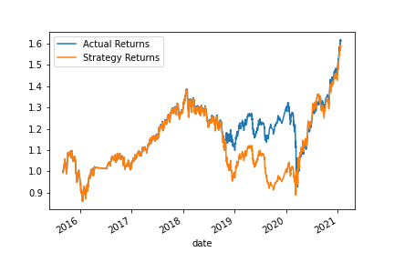
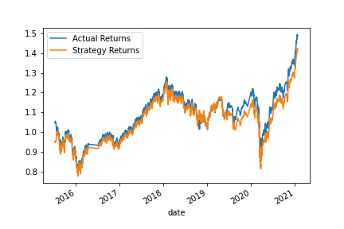

# Machine Learning Trading Bot Assignment

## Performance of the baseline trading algorithm
This is the result of the classification report for the baseline algorithm:

                precision    recall  f1-score   support

        -1.0       0.43      0.04      0.07      1804
         1.0       0.56      0.96      0.71      2288

    accuracy                           0.55      4092

We can see that the recall ratio for the algorithm is very low (4%) and the accuracy is 55% so abit more than random but when comparing this strategy to the buy and hold strategy we can see that it performs slightly better

## Performance of the trading algorithm with 5 months training data
This is the result of the classification report for the algorithm with 5 months of training data:

                precision    recall  f1-score   support

        -1.0       0.45      0.05      0.08      1745
         1.0       0.56      0.96      0.71      2232

    accuracy                           0.56      3977

We can see that the recall, precision and accuracy increased by few points with additional 2 months of training data. But in term of performance the new strategy is more correlated to the stock price and performs slightly poorly compared to the original strategy

## Performance of the trading algorithm with modified SMAs data
This is the result of the classification report for the algorithm with modified SMAs (short:10 long:120):

                precision    recall  f1-score   support

        -1.0       0.45      0.05      0.08      1745
         1.0       0.56      0.96      0.71      2232

    accuracy                           0.56      3977

We can see that the recall and precision decreased slightly while accuracy stayed the same. In term of performance this strategy is more correlated to the stock price and performs slightly poorly compared to the original strategy and to the stock price

## Performance of the trading algorithm based on logistics regression
This is the result of the classification report for the logistics regression algorithm:

                precision    recall  f1-score   support

        -1.0       0.44      0.33      0.38      1804
         1.0       0.56      0.66      0.61      2288

    accuracy                           0.52      4092

We can see that the recall ratio improved significantly (33%) and the accuracy just a bit lower at 52%. The returns of this model are eventualy lower than the baseline model but this model performs really well when the stock price is decreasing like in mid 2020

